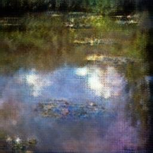
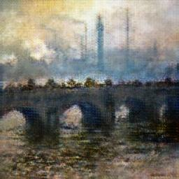

# CycleGAN-PyTorch from scratch(constructing)
原论文：[Unpaired Image-to-Image Translation using Cycle-Consistent Adversarial Networks](https://arxiv.org/abs/1703.10593)
### 本模型的部分结果集：  

### 本模型的损失函数：  

## 什么是[GAN](https://arxiv.org/pdf/1406.2661.pdf)?
>
>We propose a new framework for estimating generative models via an adversarial process, in which we simultaneously train two models:
>a generative model G that captures the data distribution, and a discriminative model D that estimates the probability that a sample   
> came from the training data rather than G.
> The training procedure for G is to maximize the probability of D making a mistake.  
>This framework corresponds to a minimax [two-player game](https://zh.wikipedia.org/zh-cn/%E9%9B%B6%E5%92%8C%E5%8D%9A%E5%BC%88)  
>
打个比方，一个专门制作赝品的团队，想要让他们伪造的梵高的画作达到以假乱真的水平。他们找来了一位曾经在梵高博物馆工作的鉴别师进行合作。他们将自己伪造的作品递给专家看，让专家
提意见，再进行改正，并重新给专家验证。在不断的重复提意见-改进-验证的博弈过程中，赝品团队和鉴别师的水平都不断得到了提高，最终终于得到了一幅完全能够骗过世界上顶级鉴别师的画作。
## [CycleGAN](https://arxiv.org/pdf/1406.2661.pdf)的优势：
传统的Domain Adaptation模型，比如[Pix2Pix](https://arxiv.org/abs/1611.07004),要求训练的数据必须成对（Paired）的出现。如下图的图片，图片的主体和位置都是基本一致的，仅仅是图片色调的更改。

而CycleGAN突破了这一限制，使得风格迁移能够作用到不同主体的图上。如将马变成斑马的过程中，斑马和马的位置可能有巨大的差异，但CycleGAN仍然能够很好的迁移图片的风格。
## 原论文的代码架构（见[原文](https://arxiv.org/pdf/1406.2661.pdf)附录7.2）
### Generator architectures
架构来源于Johnson et al，对于128*128的图像采用6个**残差块**，对于256*256的图像采用9个**残差块**。
>Let c7s1-k denote a 7×7 Convolution-InstanceNormReLU layer with k filters and stride 1. dk denotes a 3 × 3
>Convolution-InstanceNorm-ReLU layer with k filters and
>stride 2. Reflection padding was used to reduce artifacts.
Rk denotes a residual block that contains two 3 × 3 convolutional layers with the same number of filters on both
layer. uk denotes a 3 × 3 fractional-strided-ConvolutionInstanceNorm-ReLU layer with k filters and stride 1
2
.
The network with 6 residual blocks consists of:
c7s1-64,d128,d256,R256,R256,R256,
R256,R256,R256,u128,u64,c7s1-3

### Discriminator architectures
>Let Ck denote a
4 × 4 Convolution-InstanceNorm-LeakyReLU layer with k
filters and stride 2. After the last layer, we apply a convolution to produce a 1-dimensional output. We do not use
InstanceNorm for the first C64 layer. We use leaky ReLUs
with a slope of 0.2. The discriminator architecture is:
C64-C128-C256-C51
## 操作步骤
### 1.数据预处理
我们首先需要使用一个DataSet，对图像进行遍历操作。数据集来源于kaggle:[I’m Something of a Painter Myself](https://www.kaggle.com/competitions/gan-getting-started)。同时，需将图像转化为tensor形式，进行后续的计算处理。  
并用到transform函数对其进行**归一化**操作: 将图形的张量大小限制在【-1,1】，原图像为256*256的大小，我们使用（SIZE-MEAN）/STD进行处理。  
**WARNING**：在经过归一化操作后，展示图像时，不要忘记进行反归一化操作来得到原图像。

#### 归一化的理由：
一方面：如果输入层的层次过多，则反向传入到输入层的梯度就会变得非常大，归一化操作会使得图像便于收敛。  
另一方面：未处理过多图像中可能含有不稳定的特征值（如局部的过曝），在反向传播后，容易主导模型的训练，而使得其他特征遭到忽略。
### 2.按照原文给出的架构搭建模型：
数据集中的图像，均为256 * 256大小，故选择9个残差网路
### 3.训练模型
调整超参数learning rate和epochs
### 4.输出图像
## 网络中不同Block机制的详细说明
### [residual blocks](https://arxiv.org/pdf/1512.03385.pdf)(残差块)：
#### ResNet的出现:
我们在堆叠**layers**的过程中，肯定希望随着复杂度的提高，网路的表现更好。但实际实验中发现very deep的[**CNN model**](https://zh.wikipedia.org/wiki/%E5%8D%B7%E7%A7%AF%E7%A5%9E%E7%BB%8F%E7%BD%91%E7%BB%9C)，在图像识别过程中的表现不佳，训练效果并不会简单的随着网络的不断堆积而不断提升。相反，在实验中，随着模型的不断堆叠，存在着**退化**（degradation：with the network depth increasing, accuracy gets saturated）问题。且此问题的原因并不来自于[**Over Fitting**](https://en.wikipedia.org/wiki/Overfitting)。  
#### 解决方案:
试想当较浅的model，已经表现的足够好。我们在进一步堆叠**layers**的过程中，
自然期望能够提高其表现，前文已提及，这无法行得通, 
那我们便想退而求其次，至少，随着**layers**的堆叠，模型不会变的更差，即什么都不做 **恒等映射（identity mapping)**
实现H(x)=x。但事实上，因为[**Rlelu**](https://zh.wikipedia.org/wiki/%E7%BA%BF%E6%80%A7%E6%95%B4%E6%B5%81%E5%87%BD%E6%95%B0)**即非线性mapping**的存在，原始映射很大程度上是H(x)=F(x)+x。为实现**恒等映射**，我们要实现F(x)=H(x)-x，这便是**偏差方程**。
原映射便变为H(x)=F(x)+x。而实现残差映射问题要比原映射更为容易，**通过一系列的非线性变换，实现残差为0，显然要比实现恒等映射要容易的多**。  
#### 实现：  
借助于带有short cut的feedforward neural network。此结构与VGG-19相比，在更高的层数堆叠下，反而有更少的复杂度和准确性。  
  
### [Convolution blocks]()(卷积块)：  
#### 本质：
卷积的本质是对信号的一种滤波处理，在处理图像数据时，我们使用卷积核对图形的周围像素进行加权处理，与卷积核权值相似的一部分，得出的值相应更大；而想反，权值越不匹配的一部分，值会更小。这种方法可以让我们进一步对数据进行表征处理。    
#### 优点：
初步卷积得出的较低层次的特征，可以用全连接层连接，来得出更高层次的特征。（如：初步卷积提取嘴唇上的褶皱为特征，再进一步卷积辨别嘴角是否向上翘起，以前来判断是否微笑）。与传统的直接用全连接层，来映射输入到输出的完整关系，显然能够大大节约计算资源。
#### 参数：
步长(stride)：
填充(padding)：卷积核遍历的过程中，边缘的像素点往往只经过一次加权处理，而中间的像素点能够加权多次，这会导致边缘特征的丢失。因此，我们认为拓展图像的边界，使其边缘像素点也能够多次加权处理。
### 损失函数的意义：  
CycleGAN的关键在于保持它的损失一致性，
## 模型部署：  
该模型带有Web UI接口，可以直接通过

